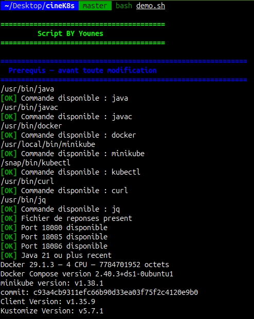

<div align="center">

# 🎬 CinéK8s — Rendu de l’examen

**Réponses et démonstration par Younes**

[Réponses](reponses.md) · [Énoncé](examen.md) · [Guide de démonstration](DEMONSTRATION.md)

</div>

Ce dépôt contient mes réponses aux sept parties de l’examen, les fichiers Docker et Kubernetes, ainsi qu’un script qui rejoue les étapes et vérifie leurs résultats.

##  Réponses et fichiers réalisés

Les explications, les commandes et les observations sont dans **[reponses.md](reponses.md)**. L’énoncé original du professeur est conservé dans **[examen.md](examen.md)**.

| Partie | Contenu du rendu |
|---|---|
| **1 — Comprendre le code** | Configuration, communication entre services et sondes de santé |
| **2 — Tests locaux** | Compilation Maven, tests Java, réservations et comportement sans movie |
| **3 — Docker et Compose** | Deux Dockerfiles, images et configuration Compose |
| **4 — Minikube** | Namespace, ConfigMaps, Deployments, Services et vérification des appels internes |
| **5 — Ingress** | Routes `cinema.local`, réservations et répartition entre les Pods movie |
| **6 — Pannes et dépannage** | Arrêt de movie, correction de ticket-debug et changement de configuration |
| **7 — Synthèse** | Données en mémoire par instance, perte des réservations et remplacement automatique des Pods |
| **Bonus B1 et B2** | Sécurité du conteneur movie et rolling update sous trafic |

Les fichiers sont disponibles dans [movie-service/](movie-service/), [ticket-service/](ticket-service/), [docker-compose.yaml](docker-compose.yaml), [k8s/](k8s/) et [broken/](broken/).

##  Aperçu des prérequis

<div align="center">



</div>

Cette capture montre le contrôle des prérequis ; les résultats de l’exécution complète sont enregistrés dans le rapport.

## ▶️ Lancer la démonstration

Prévoir **JDK Java 21+**, **Docker démarré avec Compose v2**, **Minikube**, **kubectl**, **Bash 3.2+**, **curl** et **jq**. Le cluster utilise **2 CPU et 4 Go de mémoire**, en plus des ressources nécessaires aux builds. Une connexion Internet est nécessaire au premier lancement ; Maven est fourni par les wrappers du projet.

```bash
git clone https://github.com/youneshimi/cineK8s.git
cd cineK8s
bash demo.sh --check
bash demo.sh
```

`--check` contrôle uniquement les prérequis. Le lancement complet compile les services, exécute les tests locaux, construit les images, lance Compose, déploie les YAML sur Minikube, puis vérifie l’Ingress, les pannes, la synthèse et les bonus.

Le script est prévu pour Linux et macOS. La version actuelle reste à valider par une exécution complète ; macOS n’a pas encore été testé. Les essais et les commandes détaillées sont décrits dans [DEMONSTRATION.md](DEMONSTRATION.md).

## 📊 Rapport et environnement

Chaque exécution produit **`reports/AAAAMMJJ-HHMMSS-PID/rapport.html`**, avec les résultats et les liens vers les logs. Le chemin s’affiche dans le terminal. Un code de sortie **0** indique que toutes les vérifications ont réussi ; un échec inattendu interrompt la démonstration et conserve les diagnostics.

Le script utilise un **cluster dédié** et un **kubeconfig dans le dossier du rapport**. Il conserve la configuration Kubernetes habituelle et ne modifie ni les limites système, ni le fichier `hosts`, ni les réglages Docker Desktop. Il crée les images, les caches, les fichiers de compilation et les rapports nécessaires à la démonstration. Les images `movie-service:1.0.0` et `ticket-service:1.0.0` sont reconstruites ; le profil dédié est réservé aux tests.

Les processus Java, les port-forwards et les conteneurs Compose de démonstration sont arrêtés à la fin. Le cluster reste disponible pour inspection ; les commandes d’inspection et de suppression figurent dans le [guide](DEMONSTRATION.md).
