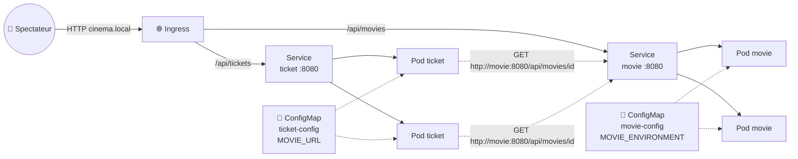
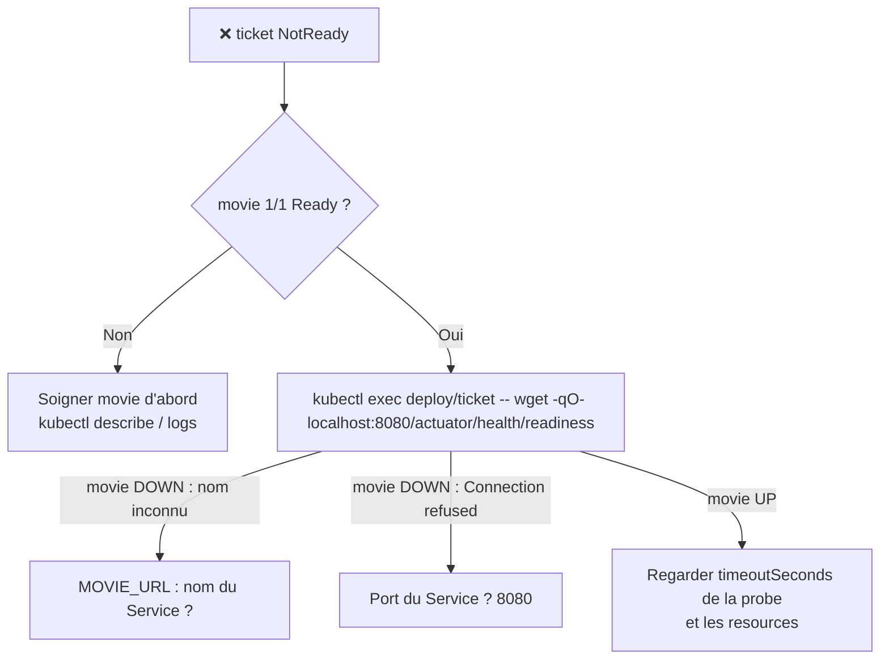

<div align="center">

# 🎬 Examen — CinéK8s : conteneuriser et déployer deux microservices Spring Boot

### *Du `mvn package` au cluster Kubernetes : le code Java est fourni, le Docker et le Kubernetes, c'est vous*


</div>

---

## 📋 Sommaire

- [📌 Consignes générales](#-consignes-générales)
- [🎯 Objectifs](#-objectifs)
- [🧱 Architecture cible](#-architecture-cible)
- [📁 Le code fourni](#-le-code-fourni)
- [🧩 Partie 1 — Comprendre le code](#-partie-1--comprendre-le-code)
- [🧪 Partie 2 — Tester en local, sans Kubernetes](#-partie-2--tester-en-local-sans-kubernetes)
- [🐳 Partie 3 — Conteneuriser](#-partie-3--conteneuriser)
- [🚀 Partie 4 — Déployer sur Minikube](#-partie-4--déployer-sur-minikube)
- [🌐 Partie 5 — Exposer avec un Ingress](#-partie-5--exposer-avec-un-ingress)
- [💥 Partie 6 — Casser pour comprendre](#-partie-6--casser-pour-comprendre)
- [🎓 Partie 7 — Questions de synthèse](#-partie-7--questions-de-synthèse)
- [⭐ Bonus — Durcir et fiabiliser](#-bonus--durcir-et-fiabiliser)
- [🩺 Dépannage](#-dépannage)
- [🧹 Nettoyage](#-nettoyage)
- [✅ Checklist de rendu](#-checklist-de-rendu)

---

## 📌 Consignes générales

> [!IMPORTANT]
> **Durée : 3 heures.** Barème sur **20 points** + **2 points de bonus**. Lisez tout l'énoncé (10 minutes bien investies) avant de commencer à taper des commandes.

- 🧩 **Ce qui est fourni** : le code Java **complet** des deux services (avec leurs tests). Vous n'avez **pas** à écrire de Java, sauf **une seule ligne de configuration** (Partie 1).
- 🛠️ **Ce que vous produisez** : deux `Dockerfile`, un `docker-compose.yaml`, le dossier `k8s/` (**vide au départ**) et un fichier `reponses.md`.
- 💡 **Les indices** : chaque tâche contient un squelette à trous (`___`, `TODO n`) et des indices dépliables `💡`. **Utiliser les indices ne coûte aucun point.**
- ✅ **Vérifiez à chaque étape** : chaque tâche se termine par un encadré « Vous devez voir… ». Si ce n'est pas le cas, ne passez pas à la suite : corrigez d'abord.

| Partie | Thème | Durée conseillée | Points |
|:------:|-------|:----------------:|:------:|
| 1 | 🧩 Comprendre le code | 15 min | — |
| 2 | 🧪 Tester en local | 15 min | — |
| 3 | 🐳 Conteneuriser (Dockerfile + Compose) | 30 min | — |
| 4 | 🚀 Déployer sur Minikube | 55 min | — |
| 5 | 🌐 Ingress | 15 min | — |
| 6 | 💥 Casser pour comprendre | 30 min | — |
| 7 | 🎓 Questions de synthèse | 10 min | — |
| — | Marge, relecture, rendu | 10 min | — |
| ⭐ | Bonus (si vous avez de l'avance) | 20 min | +2 |

> [!TIP]
> **⚡ Gérez votre temps.** Le premier `docker build` télécharge toutes les dépendances Maven (2 à 4 min). Lancez-le **en arrière-plan** (`... &`) et écrivez vos manifests Kubernetes pendant ce temps.

<details>
<summary>🧰 Aide-mémoire <code>kubectl</code> (cliquez pour déplier)</summary>

```bash
kubectl get pods -w                         # observer en continu
kubectl describe pod <pod>                  # la section Events (en bas) explique 90 % des problèmes
kubectl logs <pod> [-f] [--previous]        # logs de l'application
kubectl exec deploy/<nom> -- <commande>     # exécuter une commande dans un Pod du Deployment
kubectl get endpoints <service>             # quels Pods sont derrière ce Service ?
kubectl explain deployment.spec.template.spec.containers.readinessProbe   # doc intégrée
kubectl apply -f <fichier|dossier> --dry-run=client                       # valider la syntaxe
kubectl scale deploy/<nom> --replicas=N
kubectl rollout restart|status|undo deploy/<nom>
```
</details>

<details>
<summary>📝 Modèle du fichier <code>reponses.md</code> à rendre</summary>

````markdown
# Examen CinéK8s — NOM Prénom

## Partie 1
**Q1.1** …
**Q1.2** …
**Q1.3** (+ la ligne YAML complétée)
**Q1.4** …

## Partie 2
```
(collez ici les sorties de commandes demandées)
```
**Q2.1** …

## Partie 3
…
## Partie 4
…
## Partie 5
…
## Partie 6
(tableau de dépannage, prédictions, explications)
## Partie 7
…
````
</details>

---

## 🎯 Objectifs

> [!NOTE]
> Ce n'est plus un TD : **vous êtes seul face au cluster**. Mais vous avez tout ce qu'il faut — il suffit d'appliquer ce que vous avez vu dans les modules 101 à 105bis.
> À la fin de l'examen, vous aurez démontré que vous savez :

- ✅ **Lire** un service Spring Boot et en déduire son comportement (codes HTTP, probes, configuration)
- ✅ **Surcharger** une propriété Spring par une variable d'environnement (relaxed binding → ConfigMap)
- ✅ Écrire un **Dockerfile multi-stage**, non-root, et un `docker-compose.yaml`
- ✅ Écrire les **manifests Kubernetes** : Namespace, ConfigMap, Deployment, Service, Ingress
- ✅ Brancher les **probes** (`startup`, `liveness`, `readiness`) sur **Spring Boot Actuator**
- ✅ **Diagnostiquer** un déploiement en panne (`ErrImagePull`, `CreateContainerConfigError`, `0/1 Ready`)
- ✅ **Prédire puis observer** comment Kubernetes réagit quand un service tombe

### Prérequis — à vérifier dans les 5 premières minutes

| Outil | Pourquoi | Vérifier |
|-------|----------|----------|
| **Java 21+** | Compiler et lancer en local (Partie 2) | `java -version` |
| **Docker** | Builder les images (Partie 3) | `docker version` |
| **Minikube + kubectl** | Le cluster | `minikube status` |
| **Addon ingress** | Partie 5 | `minikube addons list \| grep ingress` |
| `jq` *(optionnel)* | Lire le JSON | `jq --version` |

> [!WARNING]
> Votre Minikube doit disposer d'au moins **2 CPU et 4 Go de RAM** (`minikube start --cpus=2 --memory=4096`). En dessous, vos Pods Java resteront `Pending`.

---

## 🧱 Architecture cible



| Service | Rôle | Endpoints | Appelle |
|---------|------|-----------|---------|
| 🎞️ `movie-service` | **Expose** l'affiche du cinéma (films et places libres, en mémoire) | `GET /api/movies`, `GET /api/movies/{id}`, `GET /api/movies/whoami` | personne |
| 🎟️ `ticket-service` | **Appelle** `movie-service` pour valider une réservation | `POST /api/tickets`, `GET /api/tickets` | `movie-service` |

> [!IMPORTANT]
> Le point clé de l'examen : `ticket-service` ne connaît **pas** l'IP des Pods `movie`. Il appelle `http://movie:8080`, le **nom du Service**, résolu par le DNS interne du cluster.

---

## 📁 Le code fourni

Tout est dans le dossier `exam-cinema/` qui vous a été remis :

```
exam-cinema/
├── movie-service/                          # 🟢 projet Maven fourni
│   ├── mvnw / mvnw.cmd / .mvn/             # Maven wrapper : pas besoin d'installer Maven
│   ├── .dockerignore
│   ├── Dockerfile                          # ✏️ À CRÉER (Partie 3)
│   ├── pom.xml
│   └── src/
│       ├── main/java/fr/k8s101/movie/
│       │   ├── MovieApplication.java
│       │   ├── Movie.java
│       │   └── MovieController.java        # expose l'API
│       ├── main/resources/application.yaml
│       └── test/java/fr/k8s101/movie/MovieControllerTest.java
├── ticket-service/                         # 🟢 même structure
│   ├── ...
│   └── src/
│       ├── main/java/fr/k8s101/ticket/
│       │   ├── TicketApplication.java
│       │   ├── MovieClient.java            # appelle movie-service
│       │   ├── MovieHealthIndicator.java   # readiness liée au service movie
│       │   ├── Ticket.java
│       │   ├── TicketRequest.java
│       │   └── TicketController.java
│       ├── main/resources/application.yaml # ✏️ 1 ligne à compléter (Partie 1)
│       └── test/java/fr/k8s101/ticket/TicketControllerTest.java
├── docker-compose.yaml                     # ✏️ À COMPLÉTER (Partie 3)
├── broken/
│   └── ticket-debug.yaml                   # 🐛 manifest cassé à réparer (Partie 6)
└── k8s/                                    # 🛠️ VIDE : c'est VOUS qui le construisez (Parties 4 et 5)
```

```bash
cd exam-cinema
```

---

## 🧩 Partie 1 — Comprendre le code

> ⏱️ **15 min** · 🎯 **3 points**
> Aucune commande ici : on **lit**, on **comprend**, on **répond**.

### Le contrôleur de `movie-service`

<details open>
<summary>📄 <code>MovieController.java</code> (extrait)</summary>

```java
@RestController
@RequestMapping("/api/movies")
public class MovieController {

    private static final List<Movie> MOVIES = List.of(
            new Movie(1, "Pod Fiction", "Thriller", new BigDecimal("10.50"), 80),
            new Movie(2, "Le Seigneur des Pods", "Fantasy", new BigDecimal("12.00"), 3),
            new Movie(3, "Docker Wars", "Science-fiction", new BigDecimal("9.00"), 150),
            new Movie(4, "Rollback to the Future", "Comédie", new BigDecimal("8.50"), 0));

    private final String environment;

    public MovieController(@Value("${movie.environment}") String environment) {
        this.environment = environment;
    }

    @GetMapping
    public List<Movie> all() { return MOVIES; }

    @GetMapping("/{id}")
    public Movie byId(@PathVariable long id) {
        return MOVIES.stream().filter(m -> m.id() == id).findFirst()
                .orElseThrow(() -> new ResponseStatusException(HttpStatus.NOT_FOUND, "Film " + id + " introuvable"));
    }

    // Utile pour voir quel Pod a répondu lorsqu'on scale le Deployment
    @GetMapping("/whoami")
    public Map<String, String> whoami() {
        return Map.of("hostname", hostname(), "environment", environment);
    }
}
```
</details>

<details open>
<summary>📄 <code>movie-service/src/main/resources/application.yaml</code></summary>

```yaml
server:
  port: 8080
  shutdown: graceful          # laisse finir les requêtes en cours lors d'un rolling update

movie:
  environment: local          # valeur par défaut, utilisée en local

management:
  endpoint:
    health:
      show-details: always
      probes:
        enabled: true         # active /actuator/health/liveness et /readiness
```
</details>

| Endpoint Actuator | Répond `UP` quand… |
|-------------------|--------------------|
| `/actuator/health/liveness` | la JVM et le contexte Spring sont vivants |
| `/actuator/health/readiness` | l'application est prête à recevoir du trafic |

### Le client HTTP de `ticket-service`

<details open>
<summary>📄 <code>MovieClient.java</code></summary>

```java
@Component
public class MovieClient {

    public record Movie(long id, String title, String genre, BigDecimal price, int seats) {}

    private final RestClient restClient;

    public MovieClient(RestClient.Builder builder, @Value("${movie.url}") String movieUrl) {
        this.restClient = builder.baseUrl(movieUrl).build();
    }

    public Optional<Movie> findMovie(long id) {
        try {
            return Optional.ofNullable(restClient.get()
                    .uri("/api/movies/{id}", id)
                    .retrieve()
                    .body(Movie.class));
        } catch (HttpClientErrorException.NotFound e) {
            return Optional.empty();
        }
    }

    /** Appelle le endpoint liveness de movie-service ; lève une exception si injoignable. */
    public void ping() {
        restClient.get().uri("/actuator/health/liveness").retrieve().toBodilessEntity();
    }
}
```
</details>

<details open>
<summary>📄 <code>TicketController.java</code> (extrait)</summary>

```java
@PostMapping
@ResponseStatus(HttpStatus.CREATED)
public Ticket create(@RequestBody TicketRequest request) {
    if (request.seats() < 1) {
        throw new ResponseStatusException(HttpStatus.BAD_REQUEST, "Il faut réserver au moins 1 place");
    }

    MovieClient.Movie movie;
    try {
        movie = movieClient.findMovie(request.movieId())
                .orElseThrow(() -> new ResponseStatusException(HttpStatus.UNPROCESSABLE_ENTITY,
                        "Film " + request.movieId() + " inconnu de l'affiche"));
    } catch (ResourceAccessException e) {
        // movie-service ne répond pas (DNS, connexion refusée, timeout…)
        throw new ResponseStatusException(HttpStatus.SERVICE_UNAVAILABLE, "movie-service injoignable : " + e.getMessage());
    }

    if (movie.seats() < request.seats()) {
        throw new ResponseStatusException(HttpStatus.CONFLICT, "Pas assez de places pour " + movie.title());
    }

    BigDecimal total = movie.price().multiply(BigDecimal.valueOf(request.seats()));
    Ticket ticket = new Ticket(sequence.incrementAndGet(), movie.id(), movie.title(),
                               request.seats(), total, Instant.now());
    tickets.add(ticket);        // liste EN MÉMOIRE, propre à chaque instance
    return ticket;
}
```
</details>

### La readiness « intelligente »

<details open>
<summary>📄 <code>MovieHealthIndicator.java</code></summary>

```java
@Component("movie")
public class MovieHealthIndicator implements HealthIndicator {

    private final MovieClient movieClient;

    public MovieHealthIndicator(MovieClient movieClient) { this.movieClient = movieClient; }

    @Override
    public Health health() {
        try {
            movieClient.ping();
            return Health.up().build();
        } catch (Exception e) {
            return Health.down().withDetail("error", e.getMessage()).build();
        }
    }
}
```
</details>

<details open>
<summary>📄 <code>ticket-service/src/main/resources/application.yaml</code> — ✏️ <b>à compléter</b></summary>

```yaml
server:
  port: 8080
  shutdown: graceful

movie:
  url: http://localhost:8080   # en local ; dans Kubernetes, ce sera surchargé

management:
  endpoint:
    health:
      show-details: always
      probes:
        enabled: true
      group:
        readiness:
          include: readinessState,___       # TODO — Q1.3
```
</details>

### 📝 Questions

> **Q1.1** *(0,5 pt)* — Quelle **propriété** Spring `MovieClient` lit-il pour connaître l'URL de movie-service ? Quelle **variable d'environnement** permet de la surcharger sans toucher au code ?

> **Q1.2** *(0,5 pt)* — Quel **code HTTP** `ticket-service` renvoie-t-il dans chacun de ces trois cas : (a) le film demandé n'existe pas ; (b) il reste moins de places que demandé ; (c) `movie-service` ne répond pas du tout ?

> **Q1.3** *(1 pt)* — **Complétez la ligne `TODO`** du fichier `ticket-service/application.yaml` pour que la **readiness** de `ticket-service` dépende de movie-service. Puis expliquez en 2 phrases pourquoi cette dépendance doit être dans la **readiness** et **jamais** dans la **liveness**.

<details>
<summary>💡 Indice pour Q1.3</summary>

Un `HealthIndicator` est référencé dans un groupe de santé par **son nom de bean**. Relisez la déclaration `@Component("…")` de `MovieHealthIndicator`.

Pour la 2ᵉ partie, imaginez que movie-service tombe : que fait le kubelet quand une **liveness** échoue ? Et quand une **readiness** échoue ?
</details>

> **Q1.4** *(1 pt)* — Complétez ce tableau, puis dites en une phrase à quoi sert `server.shutdown: graceful` lors d'un rolling update.

| Endpoint | Probe(s) Kubernetes qui l'utilisent | Conséquence d'un **échec** de la probe |
|----------|-------------------------------------|----------------------------------------|
| `/actuator/health/liveness` | ? | ? |
| `/actuator/health/readiness` | ? | ? |

---

## 🧪 Partie 2 — Tester en local, sans Kubernetes

> ⏱️ **15 min** · 🎯 **2 points**
> Avant de conteneuriser, on vérifie que le code fonctionne **tel quel**. Si vous avez bien fait la Partie 1, la readiness de `ticket` doit refléter l'état de `movie`.

### 2.1 — Lancer les deux services *(1 pt)*

```bash
# Terminal 1 — movie-service sur :8080 (la compilation lance aussi les tests)
cd movie-service && ./mvnw -q package && java -jar target/movie-service-1.0.0.jar

# Terminal 2 — ticket-service sur :8082 (le 8080 est déjà pris)
cd ticket-service && ./mvnw -q package && SERVER_PORT=8082 java -jar target/ticket-service-1.0.0.jar
```

```bash
# Terminal 3
curl -s localhost:8080/api/movies | jq '.[].title'
curl -s localhost:8080/api/movies/whoami

curl -s -X POST localhost:8082/api/tickets \
  -H 'Content-Type: application/json' \
  -d '{"movieId":2,"seats":3}' | jq

curl -s localhost:8082/actuator/health/readiness | jq
```

> ✅ **Vous devez voir** : `whoami` → `"environment":"local"` · une réservation avec `"total":36.00` · une readiness `"status":"UP"` avec `movie` et `readinessState` en `UP`.

📋 **Collez dans `reponses.md`** les sorties des deux dernières commandes.

### 2.2 — Couper `movie-service` *(0,5 pt)*

🔥 **Coupez le terminal 1** (`Ctrl+C`), puis :

```bash
curl -s localhost:8082/actuator/health/readiness | jq
curl -s localhost:8082/actuator/health/liveness  | jq .status
curl -s -o /dev/null -w '%{http_code}\n' -X POST localhost:8082/api/tickets \
  -H 'Content-Type: application/json' -d '{"movieId":2,"seats":3}'
```

> ✅ **Vous devez voir** : readiness `DOWN` (avec un `error` en détail), liveness `"UP"`, et un code HTTP `503`.
> ⚠️ Si la readiness reste `UP` alors que movie est arrêté, **relisez votre réponse Q1.3**.

### 2.3 — Questions *(0,5 pt)*

> **Q2.1** — Pourquoi lance-t-on `ticket-service` avec `SERVER_PORT=8082` plutôt qu'en modifiant `application.yaml` ? Quel mécanisme Spring Boot rend cela possible ?

> **Q2.2** — Dans l'étape 2.2, la liveness est restée `UP` alors que la readiness est passée `DOWN`. Pourquoi est-ce exactement le comportement voulu ?

> [!NOTE]
> Retenez ce comportement : c'est ce que vous observerez dans Kubernetes en Partie 6 — sauf que là, **c'est le cluster qui agira** en retirant le Pod du Service.

---

## 🐳 Partie 3 — Conteneuriser

> ⏱️ **30 min** · 🎯 **3 points**
> Objectif : produire **une image par service**, légère et non-root, puis vérifier que les deux conteneurs se parlent **avant** d'attaquer Kubernetes.

### 3.1 — Le Dockerfile multi-stage *(1,5 pt)*

Créez `movie-service/Dockerfile` à partir de ce squelette. **Les commentaires sont sur leur propre ligne** (en Dockerfile, un `# …` en fin de ligne n'est *pas* un commentaire !).

```dockerfile
# ── Étape 1 : build ─────────────────────────────────────────────────────────
# TODO 1 : image de build (Maven + JDK 21)
FROM ___ AS build
WORKDIR /app

# TODO 2 : copier le pom.xml SEUL, puis télécharger les dépendances (mise en cache)
___
___

# TODO 3 : copier les sources, puis compiler SANS lancer les tests
___
___

# ── Étape 2 : image finale (JRE seulement, non-root) ────────────────────────
# TODO 4 : image d'exécution (JRE 21, variante alpine)
FROM ___
WORKDIR /app

# TODO 5 : créer un utilisateur système « spring » d'UID 10001, puis basculer dessus
___
___

# TODO 6 : récupérer le jar produit à l'étape « build » et le nommer app.jar
___

# TODO 7 : port d'écoute documenté
EXPOSE ___

# TODO 8 : lancer le jar, avec une JVM qui dimensionne son heap à 75 % de la mémoire du conteneur
ENTRYPOINT [___]
```

| TODO | 💡 Indice |
|:----:|-----------|
| 1 | Il faut **Maven et un JDK 21** dans la même image. Les images officielles Maven existent en variantes `eclipse-temurin`. |
| 2 | Deux instructions : `COPY` puis `RUN`. Le goal Maven qui pré-télécharge tout s'appelle `dependency:go-offline`. Ajoutez `-q -B` (silencieux, non interactif). |
| 3 | `COPY src ./src` puis `mvn package` avec le drapeau qui saute les tests (`-DskipTests`). |
| 4 | L'image **JRE** (pas JDK) d'Eclipse Temurin, en version 21, variante `-alpine`. |
| 5 | Sous Alpine : `addgroup -S <groupe>` et `adduser -S -u <uid> -G <groupe> <user>` (dans **un seul** `RUN`, avec `&&`). Puis l'instruction `USER`. |
| 6 | `COPY --from=<nom de l'étape>` : le nom a été donné par `AS` à l'étape 1. Le jar est dans `/app/target/`. |
| 7 | Cherchez le port dans `application.yaml`. |
| 8 | Format **JSON** (exec form) : `["java", "-XX:…", "-jar", "app.jar"]`. Le drapeau est `MaxRAMPercentage`. |

<details>
<summary>🔎 Besoin d'un coup de pouce supplémentaire ?</summary>

- Étape 1 : l'image porte un tag de la forme `maven:3.9-eclipse-temurin-21`.
- Étape 2 : l'image est de la forme `eclipse-temurin:21-jre-alpine`.
- `RUN mvn -q -B dependency:go-offline` et `RUN mvn -q -B package -DskipTests`.
- Pourquoi **copier le `pom.xml` avant `src/`** ? Réfléchissez au cache des couches Docker (Q3.1).
</details>

Les deux services sont **construits de la même façon** : une fois le premier Dockerfile validé, dupliquez-le.

```bash
docker build -t movie-service:1.0.0 ./movie-service
cp movie-service/Dockerfile ticket-service/Dockerfile
docker build -t ticket-service:1.0.0 ./ticket-service

docker images | grep -E 'movie-service|ticket-service'
docker run --rm --entrypoint id movie-service:1.0.0
```

> ✅ **Vous devez voir** : deux images d'environ **200 à 250 Mo** (pas 700 !) et un `uid=10001(spring)` — **surtout pas** `uid=0(root)`.

### 3.2 — Docker Compose *(1 pt)*

Complétez `docker-compose.yaml` :

```yaml
services:
  movie:
    build: ./movie-service
    # TODO 1 : nom:tag de l'image produite
    image: ___
    ports: ["8080:8080"]
    environment:
      # TODO 2 : la variable d'environnement qui surcharge la propriété movie.environment
      ___: compose
    healthcheck:
      # TODO 3 : l'URL de la liveness (commande wget, comme ci-dessous)
      test: ["CMD", "wget", "-qO-", "___"]
      interval: 5s
      retries: 20

  ticket:
    build: ./ticket-service
    image: ticket-service:1.0.0
    ports: ["8082:8080"]
    environment:
      # TODO 4 : la variable qui surcharge movie.url ; la valeur utilise le NOM du service Compose
      ___: ___
    depends_on:
      # TODO 5 : attendre que le service movie soit "healthy"
      ___:
        condition: ___
```

| TODO | 💡 Indice |
|:----:|-----------|
| 1 | Même nom que celui utilisé pour `docker build -t`. |
| 2 | **Relaxed binding** : `movie.environment` → majuscules, points remplacés par `_`. |
| 3 | Le chemin est celui des probes Actuator (Partie 1). Dans le conteneur, l'application écoute sur `localhost:8080`. |
| 4 | Même règle qu'au TODO 2, pour `movie.url`. Dans Compose, le **nom du service** fait office de DNS : `http://<service>:<port>`. |
| 5 | La clé est le nom du service dont on dépend. La condition qui attend le `healthcheck` s'écrit `service_healthy`. |

```bash
docker compose up -d --build
docker compose ps                                  # movie (healthy), ticket (running)
curl -s localhost:8080/api/movies/whoami
curl -s -X POST localhost:8082/api/tickets -H 'Content-Type: application/json' -d '{"movieId":1,"seats":2}'
docker compose down
```

> ✅ **Vous devez voir** : `"environment":"compose"` (la variable d'environnement a bien **surchargé** `application.yaml`) et une réservation à `21.00`.

### 3.3 — Questions *(0,5 pt)*

> **Q3.1** — Pourquoi copie-t-on `pom.xml` **avant** `src/` dans le Dockerfile ? Que se passe-t-il quand vous ne modifiez qu'une ligne de Java ?

> **Q3.2** — Pourquoi `-XX:MaxRAMPercentage=75` est-il préférable à `-Xmx512m` dans un conteneur ?

> **Q3.3** — Compose a `depends_on: condition: service_healthy`. Kubernetes n'a **pas** d'équivalent direct. Que se passe-t-il, dans Kubernetes, si les Pods `ticket` démarrent **avant** les Pods `movie` ?

---

## 🚀 Partie 4 — Déployer sur Minikube

> ⏱️ **55 min** · 🎯 **6 points**
> Le cœur de l'examen. Vous construisez, un à un, les fichiers du dossier `k8s/`.

### 4.0 — Charger les images dans Minikube *(0,5 pt)*

Au choix (une seule option suffit) :

```bash
# Option A — pointer votre Docker sur celui de Minikube (pour ce terminal), puis rebuilder
eval $(minikube docker-env)
docker build -t movie-service:1.0.0  ./movie-service
docker build -t ticket-service:1.0.0 ./ticket-service

# Option B — construire directement avec Minikube
minikube image build -t movie-service:1.0.0  ./movie-service
minikube image build -t ticket-service:1.0.0 ./ticket-service

# Option C — réutiliser les images déjà construites (Partie 3)
minikube image load movie-service:1.0.0
minikube image load ticket-service:1.0.0
```

```bash
minikube image ls | grep -E 'movie|ticket'
```

> ✅ **Vous devez voir** : les deux images `movie-service:1.0.0` et `ticket-service:1.0.0` listées.

### 4.1 — Namespace et ConfigMaps *(1 pt)*

📄 **`k8s/00-namespace.yaml`**

```yaml
apiVersion: v1
# TODO 1 : le type de ressource
kind: ___
metadata:
  # TODO 2 : le namespace de l'examen s'appelle cinema-exam
  name: ___
```

📄 **`k8s/10-config.yaml`** — deux ConfigMaps dans le même fichier, séparées par `---`

```yaml
apiVersion: v1
kind: ConfigMap
metadata:
  name: movie-config
  namespace: cinema-exam
data:
  # TODO 3 : clé = NOM DE LA VARIABLE D'ENVIRONNEMENT, valeur = kubernetes
  ___: kubernetes
---
# TODO 4 : une seconde ConfigMap « ticket-config » (même namespace).
# Elle doit fournir à ticket-service l'URL de movie-service : http://movie:8080
```

| TODO | 💡 Indice |
|:----:|-----------|
| 1 | Un Namespace est une ressource du groupe d'API « core » (`v1`). |
| 2 | Énoncé : `cinema-exam`. Ce nom sera repris dans **tous** les `metadata.namespace`. |
| 3 | Reprenez le nom de variable trouvé en Partie 3 (TODO 2 du Compose). |
| 4 | La structure est **identique** à `movie-config`. La clé est la variable trouvée au TODO 4 du Compose ; la valeur est le **nom du Service** Kubernetes + le port. |

> [!TIP]
> **DNS interne** : dans le même namespace, `http://movie:8080` suffit. La forme complète est `<service>.<namespace>.svc.cluster.local`.

### 4.2 — `movie` : Deployment + Service *(1,5 pt)*

📄 **`k8s/20-movie.yaml`**

```yaml
# TODO 1 : apiVersion d'un Deployment
apiVersion: ___
kind: Deployment
metadata:
  name: movie
  namespace: cinema-exam
spec:
  # TODO 2 : 2 réplicas
  replicas: ___
  selector:
    matchLabels:
      # TODO 3 : app: movie
      ___: ___
  template:
    metadata:
      labels:
        # TODO 3 (bis) : exactement le même label
        ___: ___
    spec:
      containers:
        - name: movie
          # TODO 4 : l'image chargée à l'étape 4.0
          image: ___
          # TODO 5 : ne jamais aller chercher l'image sur Internet si elle est déjà sur le nœud
          imagePullPolicy: ___
          ports:
            - name: http
              # TODO 6 : le port d'écoute de Spring Boot
              containerPort: ___
          # TODO 7 : injecter TOUTES les clés de la ConfigMap movie-config comme variables d'environnement
          envFrom:
            ___
          # TODO 8 : requests = cpu 100m + memory 256Mi ; limits = memory 512Mi (pas de limite CPU)
          resources:
            ___
          # TODO 9 : startupProbe — GET /actuator/health/liveness, toutes les 2 s, 30 échecs maximum
          startupProbe:
            ___
          # TODO 10 : livenessProbe — GET /actuator/health/liveness, toutes les 10 s
          livenessProbe:
            ___
          # TODO 11 : readinessProbe — GET /actuator/health/readiness, toutes les 5 s
          readinessProbe:
            ___
---
apiVersion: v1
kind: Service
metadata:
  # TODO 12 : ce nom DEVIENT le nom DNS (http://<nom>:8080) → cf. la valeur de MOVIE_URL
  name: ___
  namespace: cinema-exam
spec:
  # TODO 13 : sélectionner les Pods de movie
  selector:
    ___: ___
  ports:
    # TODO 14 : le Service écoute sur 8080 et envoie vers le port NOMMÉ « http » du conteneur
    - name: http
      port: ___
      targetPort: ___
```

| TODO | 💡 Indice |
|:----:|-----------|
| 1 | Les Deployments sont dans le groupe d'API `apps`. Format : `groupe/version`. |
| 3 | ⚠️ **Piège classique** : le même label doit apparaître à **trois** endroits — `selector.matchLabels`, `template.metadata.labels` et `selector` du Service. Sinon : Deployment rejeté, ou Service **sans endpoints**. |
| 4 | Nom **et tag** exacts, cf. `minikube image ls`. |
| 5 | Valeur qui signifie « utiliser le registre seulement si l'image est absente du nœud ». |
| 7 | `envFrom` attend une **liste** ; chaque élément est un `configMapRef` avec un `name`. |
| 8 | Unités : `m` pour les millicores, `Mi` pour les mébioctets. |
| 9 → 11 | Une probe = `httpGet` (`path` + `port`) + `periodSeconds` (+ `failureThreshold` pour la startup). Vous pouvez référencer le port par son **nom** (`http`). |
| 12 | Si le nom ne correspond pas à la valeur de `MOVIE_URL`, le DNS ne résoudra rien. |
| 14 | `targetPort` accepte un **nom** de port (celui déclaré dans le conteneur). |

<details>
<summary>🔎 Besoin d'un coup de pouce supplémentaire ? (formes génériques)</summary>

```yaml
envFrom:
  - configMapRef:
      name: <nom-de-la-configmap>

resources:
  requests: { cpu: <…>, memory: <…> }
  limits:   { memory: <…> }

<xxx>Probe:
  httpGet:
    path: <chemin>
    port: <nom ou numéro de port>
  periodSeconds: <n>
  failureThreshold: <n>          # facultatif (3 par défaut)
```

Et pour consulter la doc intégrée :

```bash
kubectl explain deployment.spec.template.spec.containers.startupProbe
kubectl explain deployment.spec.template.spec.containers.envFrom
```
</details>

> [!TIP]
> **Pourquoi une `startupProbe` ?** Spring Boot peut mettre 10 à 40 s à démarrer. Sans elle, il faudrait un `initialDelaySeconds` sur la liveness : trop court → redémarrages en boucle, trop long → détection lente. La startupProbe **suspend** les autres probes tant que l'appli n'a pas démarré.

### 4.3 — `ticket` : Deployment + Service *(1,5 pt)*

Cette fois, **pas de squelette** : vous réutilisez ce que vous venez d'écrire. Créez `k8s/30-ticket.yaml` (Deployment **+** Service) en respectant ce cahier des charges :

| Élément | Valeur attendue |
|---------|-----------------|
| Deployment | nom `ticket`, **2 réplicas**, label `app: ticket` |
| Image | `ticket-service:1.0.0`, `imagePullPolicy: IfNotPresent` |
| Configuration | `envFrom` → ConfigMap **`ticket-config`** |
| Ressources | identiques à `movie` |
| `startupProbe` et `livenessProbe` | `/actuator/health/liveness`, mêmes réglages que `movie` |
| `readinessProbe` | `/actuator/health/readiness`, `periodSeconds: 5` **et `timeoutSeconds: 3`** |
| Service | nom `ticket`, type ClusterIP, port `8080` → port nommé `http` |

<details>
<summary>💡 Indices</summary>

1. Copiez `20-movie.yaml` et remplacez **tous** les `movie` pertinents : `name`, labels, `selector`, `image`, nom de ConfigMap, nom du conteneur, nom du Service. Oubliez-en un, et ça casse (voir Dépannage).
2. **Pourquoi `timeoutSeconds: 3` ?** La readiness de `ticket` appelle elle-même `movie` en HTTP (`MovieHealthIndicator`). Le timeout **par défaut** d'une probe est de 1 seconde : une JVM un peu lente ferait échouer la probe à tort.
3. Vérifiez le nom du champ avec : `kubectl explain deployment.spec.template.spec.containers.readinessProbe`.
</details>

### 4.4 — Appliquer et vérifier *(1 pt)*

```bash
kubectl apply -f k8s/ --dry-run=client          # la syntaxe est-elle valide ?
kubectl apply -f k8s/
kubectl config set-context --current --namespace=cinema-exam
kubectl get pods -w
```

> ✅ **Vous devez voir** (après 20 à 60 s — le `0/1` initial correspond à la startupProbe, c'est normal) :

```
NAME                      READY   STATUS    RESTARTS   AGE
movie-7d9f6c8b5-4xk2p     1/1     Running   0          50s
movie-7d9f6c8b5-m9qzt     1/1     Running   0          50s
ticket-6c8d7f9b4-2hl8n    1/1     Running   0          50s
ticket-6c8d7f9b4-w7r3v    1/1     Running   0          50s
```

```bash
kubectl get endpoints movie ticket              # 2 adresses IP pour chacun

# Appel inter-services, depuis un Pod ticket, par le NOM du Service
kubectl exec deploy/ticket -- wget -qO- http://movie:8080/api/movies/whoami
kubectl exec deploy/ticket -- wget -qO- http://localhost:8080/actuator/health/readiness

# Passer une commande via un port-forward temporaire
kubectl port-forward svc/ticket 8082:8080 &
curl -s -X POST localhost:8082/api/tickets -H 'Content-Type: application/json' \
  -d '{"movieId":2,"seats":2}' | jq
kill %1
```

> ✅ **Vous devez voir** : `"environment":"kubernetes"` et un `hostname` de Pod `movie-…` · une readiness `UP` avec `movie` en `UP` · une réservation à `"total":24.00`.

📋 **Collez dans `reponses.md`** : le `kubectl get pods`, le `kubectl get endpoints` et la réservation créée.

### 4.5 — Questions *(0,5 pt)*

> **Q4.1** — `kubectl apply -f k8s/` traite les fichiers dans quel ordre ? En quoi les préfixes `00-`, `10-`, `20-`… sont-ils utiles ici ?

> **Q4.2** — Pendant environ 30 s après le déploiement, les Pods sont `0/1`. Quelle probe est responsable ? Est-ce une anomalie ?

> **Q4.3** — Que se passerait-il avec `imagePullPolicy: Always` sur ces images ? Pourquoi ?

---

## 🌐 Partie 5 — Exposer avec un Ingress

> ⏱️ **15 min** · 🎯 **2 points**

### 5.1 — Préparer l'accès *(0,5 pt)*

```bash
minikube addons enable ingress
kubectl get pods -n ingress-nginx             # attendre le controller en 1/1 Running
echo "$(minikube ip) cinema.local" | sudo tee -a /etc/hosts
```

> [!TIP]
> Sur **macOS avec le driver docker**, `minikube ip` n'est pas joignable directement. Lancez `minikube tunnel` dans un terminal dédié et utilisez `127.0.0.1 cinema.local` dans `/etc/hosts`.

### 5.2 — Écrire l'Ingress *(1 pt)*

📄 **`k8s/40-ingress.yaml`** — `/api/movies` → service `movie` · `/api/tickets` → service `ticket`

```yaml
# TODO 1 : apiVersion d'un Ingress (groupe networking.k8s.io)
apiVersion: ___
kind: Ingress
metadata:
  name: cinema
  namespace: cinema-exam
spec:
  # TODO 2 : la classe d'Ingress de l'addon Minikube
  ingressClassName: ___
  rules:
    # TODO 3 : le nom d'hôte déclaré dans /etc/hosts
    - host: ___
      http:
        paths:
          # TODO 4 : le chemin /api/movies
          - path: ___
            # TODO 5 : Prefix ou Exact ? (voir Q5.2)
            pathType: ___
            backend:
              service:
                # TODO 6 : le Service de destination et son port NOMMÉ
                name: ___
                port:
                  name: ___
          # TODO 7 : une seconde règle, /api/tickets → service ticket
```

| TODO | 💡 Indice |
|:----:|-----------|
| 1 | Les Ingress ne sont pas dans `v1` ni dans `apps`. |
| 2 | `kubectl get ingressclass` vous donne la réponse. |
| 5 | Les deux services servent **déjà** leurs routes sous `/api/…` : pas besoin de *rewrite*. Il faut que `/api/movies/1` soit aussi routé. |
| 6 | Dans le Service, le port s'appelle `http` (vous l'avez nommé en 4.2). |

```bash
kubectl apply -f k8s/40-ingress.yaml
kubectl describe ingress cinema            # les 2 règles doivent apparaître, avec des backends
```

### 5.3 — Tester *(0,25 pt)*

```bash
curl -s http://cinema.local/api/movies | jq '.[].title'
curl -s -X POST http://cinema.local/api/tickets -H 'Content-Type: application/json' \
  -d '{"movieId":3,"seats":10}' | jq

# Le load-balancing du Service, visible à l'œil nu
for i in $(seq 1 6); do curl -s http://cinema.local/api/movies/whoami | jq -r .hostname; done

curl -s -o /dev/null -w '%{http_code}\n' http://cinema.local/actuator/health
```

> ✅ **Vous devez voir** : la liste des films · une réservation à `90.00` · **deux** `hostname` différents qui alternent · un code HTTP final de ☝️ la dernière commande (à commenter en Q5.3).

### 5.4 — Questions *(0,25 pt)*

> **Q5.1** — Combien de Pods `movie` distincts ont répondu dans la boucle ? Quel objet Kubernetes répartit la charge entre eux ?

> **Q5.2** — Que se passerait-il pour `GET /api/movies/1` si vous aviez mis `pathType: Exact` sur `/api/movies` ?

> **Q5.3** — Quel code HTTP obtenez-vous pour `/actuator/health` via `cinema.local` ? Est-ce souhaitable ? Pourquoi ?

---

## 💥 Partie 6 — Casser pour comprendre

> ⏱️ **30 min** · 🎯 **3 points**
> Un bon ingénieur ne sait pas seulement déployer : il sait **diagnostiquer**. Ici, c'est vous qui allez casser, puis réparer.

### 6.1 — Le service `movie` disparaît *(1 pt)*

✍️ **Avant de lancer la moindre commande**, écrivez dans `reponses.md` vos **prédictions** :

- (a) `READY` et `RESTARTS` des Pods `ticket` après 30 s ?
- (b) Contenu de `kubectl get endpoints ticket` ?
- (c) Code HTTP de `GET http://cinema.local/api/tickets` ?
- (d) Statut de la **liveness** de `ticket` ?

Puis **observez** :

```bash
kubectl scale deploy/movie --replicas=0
sleep 30        # la readiness échoue 3 fois de suite (3 × 5 s) avant de basculer
kubectl get pods
kubectl get endpoints ticket
curl -si http://cinema.local/api/tickets | head -1
kubectl describe pod -l app=ticket | grep -i "probe failed"
```

Rétablissez ensuite le service et observez le retour à la normale **sans rien toucher à `ticket`** :

```bash
kubectl scale deploy/movie --replicas=2
kubectl get pods -w
```

> **Q6.1** *(0,5 pt pour les prédictions + observations, 0,5 pt pour l'explication)* — Expliquez **en 4 étapes** ce qui s'est passé entre l'arrêt de `movie` et le code HTTP que vous avez obtenu. Pourquoi `RESTARTS` est-il resté à `0` ?

### 6.2 — Mission dépannage *(1,5 pt)*

Le fichier `broken/ticket-debug.yaml` contient un Deployment `ticket-debug` écrit par un collègue pressé… **il contient 3 erreurs**, qui se révèlent **l'une après l'autre**.

<details>
<summary>📄 <code>broken/ticket-debug.yaml</code> (fourni — ne le modifiez pas avant de l'avoir appliqué une première fois)</summary>

```yaml
apiVersion: apps/v1
kind: Deployment
metadata:
  name: ticket-debug
  namespace: cinema-exam
spec:
  replicas: 1
  selector:
    matchLabels: { app: ticket-debug }
  template:
    metadata:
      labels: { app: ticket-debug }
    spec:
      containers:
        - name: ticket
          image: ticket-service:1.0.0
          imagePullPolicy: Always
          ports:
            - name: http
              containerPort: 8080
          envFrom:
            - configMapRef:
                name: ticket-configmap
          readinessProbe:
            httpGet: { path: /actuator/health/readiness, port: 8081 }
            periodSeconds: 5
```
</details>

```bash
kubectl apply -f broken/ticket-debug.yaml
kubectl get pods -l app=ticket-debug -w
```

**Méthode attendue**, pour **chaque** problème rencontré :

1. Relevez le **statut** exact affiché par `kubectl get pods`.
2. Trouvez la **cause** avec `kubectl describe pod …` (section **Events**).
3. **Corrigez le YAML** (jamais le code Java), puis `kubectl apply -f broken/ticket-debug.yaml`.

Remplissez ce tableau dans `reponses.md` :

| # | Statut observé | Commande de diagnostic | Cause exacte | Correction apportée |
|---|----------------|------------------------|--------------|---------------------|
| 1 | | | | |
| 2 | | | | |
| 3 | | | | |

<details>
<summary>💡 Indices (où regarder selon le statut)</summary>

| Statut | Où regarder |
|--------|-------------|
| `ErrImagePull` / `ImagePullBackOff` | `kubectl describe pod` → Events. Où l'image est-elle réellement disponible ? Que dit la politique de pull ? |
| `CreateContainerConfigError` | `kubectl describe pod` → Events. La ressource **référencée** existe-t-elle ? (`kubectl get cm`) |
| `Running` mais `0/1` pour toujours | Events : `Readiness probe failed…`. Sur quel port l'application écoute-t-elle ? |
</details>

> ✅ **Objectif** : `kubectl get pods -l app=ticket-debug` → `1/1 Running`. Terminez par `kubectl delete -f broken/ticket-debug.yaml`.

### 6.3 — Changer la configuration sans rebuild *(0,5 pt)*

Passez `MOVIE_ENVIRONMENT` à `production` dans `10-config.yaml`, puis :

```bash
kubectl apply -f k8s/10-config.yaml
curl -s http://cinema.local/api/movies/whoami        # toujours "kubernetes" !
kubectl rollout restart deploy/movie
kubectl rollout status deploy/movie
curl -s http://cinema.local/api/movies/whoami        # "production"
```

> **Q6.3** — Pourquoi la modification n'a-t-elle **pas** été prise en compte immédiatement ? Qu'est-ce qui l'a rendue effective ?

---

## 🎓 Partie 7 — Questions de synthèse

> ⏱️ **10 min** · 🎯 **1 point** *(≈ 0,33 pt par question — répondez en 3 à 5 lignes maximum)*

> **Q7.1** — Décrivez ce qui se passe, étape par étape, quand un Pod `ticket` exécute `GET http://movie:8080/api/movies/1` : qui résout le nom `movie` ? en quoi ? comment la requête atteint-elle *un* Pod `movie` précis ?

> **Q7.2** — Créez 4 réservations puis lancez plusieurs fois :
> ```bash
> curl -s http://cinema.local/api/tickets | jq length
> ```
> Le nombre varie d'un appel à l'autre. **Pourquoi ?** Que se passe-t-il si vous supprimez les Pods `ticket` ? Quelle est la solution **architecturale** (pas une astuce) ?

> **Q7.3** — Supprimez un Pod `movie` à la main :
> ```bash
> kubectl delete pod $(kubectl get pod -l app=movie -o name | head -1)
> kubectl get pods
> ```
> Que constatez-vous ? Qu'auriez-vous perdu si vous aviez déployé un `kind: Pod` « nu » à la place d'un `Deployment` ?

---

## ⭐ Bonus — Durcir et fiabiliser

> ⏱️ **20 min** · 🎯 **+2 points** — *à n'aborder que si les Parties 1 → 7 sont terminées.*

### ⭐ B1 — Durcir le Deployment `movie` *(+1 pt)*

Ajoutez au **conteneur** `movie` (dans `20-movie.yaml`) un `securityContext` qui :

- impose de ne **pas** tourner en root, avec l'UID **10001** ;
- interdit l'élévation de privilèges ;
- retire **toutes** les *capabilities* Linux ;
- rend le système de fichiers racine **en lecture seule**.

<details>
<summary>💡 Indices</summary>

- Les champs s'appellent `runAsNonRoot`, `runAsUser`, `allowPrivilegeEscalation`, `capabilities.drop`, `readOnlyRootFilesystem`. Cherchez-les avec `kubectl explain pod.spec.containers.securityContext`.
- ⚠️ Après ce changement, vos Pods vont probablement **crasher**. Regardez `kubectl logs` : Tomcat a besoin d'**écrire** quelque part. Un volume de type `emptyDir` monté sur `/tmp` règle le problème (`volumes` au niveau du Pod, `volumeMounts` au niveau du conteneur).
</details>

> ✅ **Vérification** : `kubectl exec deploy/movie -- id` → `uid=10001` · `kubectl exec deploy/movie -- touch /test` → `Read-only file system`, et les Pods sont `1/1`.

### ⭐ B2 — Rolling update sans coupure *(+1 pt)*

Ajoutez à `movie` une `strategy` de type `RollingUpdate` qui n'autorise **aucun** Pod indisponible pendant la mise à jour (`maxUnavailable: 0`, `maxSurge: 1`). Puis, **pendant** un `kubectl rollout restart deploy/movie`, lancez dans un autre terminal :

```bash
for i in $(seq 1 300); do curl -s -o /dev/null -w '%{http_code}\n' http://cinema.local/api/movies; sleep 0.2; done | sort | uniq -c
```

> **QB2** — Quel est le résultat ? Quels trois éléments (`strategy`, `readinessProbe`, `shutdown: graceful`) y contribuent, et comment ?

---

## 🩺 Dépannage

| Symptôme | Cause probable | Commande de diagnostic |
|----------|----------------|------------------------|
| `ErrImagePull` / `ImagePullBackOff` | Image absente de Minikube, ou `imagePullPolicy: Always` | `minikube image ls \| grep -E 'movie\|ticket'` |
| `CreateContainerConfigError` | ConfigMap référencée inexistante ou mal nommée | `kubectl describe pod …` → Events · `kubectl get cm` |
| `0/1 Ready` qui dure > 60 s puis `RESTARTS` qui grimpe | JVM trop lente : startupProbe dépassée | `kubectl describe pod …` → augmenter `failureThreshold` |
| `OOMKilled` | `limits.memory` trop bas pour la JVM | `kubectl get pod -o jsonpath='{..lastState}'` → monter à `768Mi` |
| `ticket` `0/1 Ready`, `movie` `1/1` | `MOVIE_URL` erronée (nom, port, namespace) | `kubectl exec deploy/ticket -- wget -qO- localhost:8080/actuator/health/readiness` |
| `Pending` | Pas assez de CPU/RAM dans Minikube | `kubectl describe pod …` → « Insufficient cpu/memory » |
| Le Service n'a **aucun** endpoint | Label du Service ≠ label des Pods | `kubectl get endpoints movie` · `kubectl get pods --show-labels` |
| `503` sur `/api/tickets` via l'Ingress | Aucun endpoint `ticket` prêt | `kubectl get endpoints ticket` |
| `404` via l'Ingress, `200` en port-forward | `path`, `pathType` ou `host` incorrect | `kubectl describe ingress cinema` |
| `curl: Could not resolve host: cinema.local` | `/etc/hosts` non mis à jour (ou `minikube tunnel` absent sur mac) | `cat /etc/hosts \| grep cinema` |



---

## ✅ Checklist de rendu

Avant de rendre votre dossier (archive `NOM_Prenom.zip` contenant `exam-cinema/` **et** `reponses.md`) :

- [ ] `ticket-service/application.yaml` : la readiness inclut `movie` *(Partie 1)*
- [ ] `movie-service/Dockerfile` et `ticket-service/Dockerfile` : multi-stage, JRE, **non-root** *(Partie 3)*
- [ ] `docker-compose.yaml` fonctionnel : `"environment":"compose"` *(Partie 3)*
- [ ] `k8s/00-namespace.yaml`, `10-config.yaml`, `20-movie.yaml`, `30-ticket.yaml`, `40-ingress.yaml` *(Parties 4 et 5)*
- [ ] `MOVIE_URL=http://movie:8080` fourni par **ConfigMap**, pas par le code
- [ ] Les trois probes branchées sur Actuator ; la readiness de `ticket` a `timeoutSeconds: 3`
- [ ] Appel inter-services vérifié avec `kubectl exec … wget`
- [ ] Ingress `cinema.local` routant `/api/movies` et `/api/tickets`
- [ ] Scénario « movie à 0 réplica » observé : `0/1 Ready`, `RESTARTS 0`, `503` propre
- [ ] Les **3 bugs** de `ticket-debug` documentés dans le tableau
- [ ] `reponses.md` complet : toutes les questions Q1.1 → Q7.3, avec les sorties de commandes demandées

---

<div align="center">

<sub>🎬 Bonne chance ! Rappelez-vous : lisez les <b>Events</b>, vérifiez à chaque étape, et n'oubliez pas que <code>kubectl describe</code> est votre meilleur ami.</sub>

</div>
